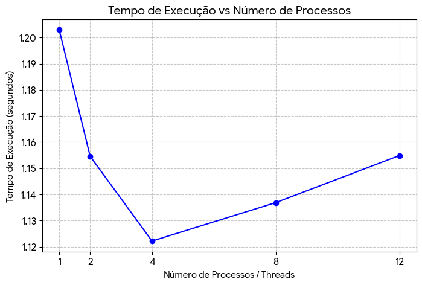
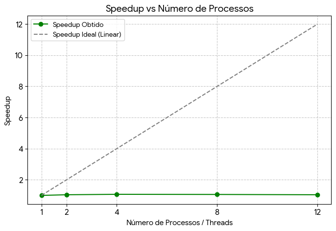
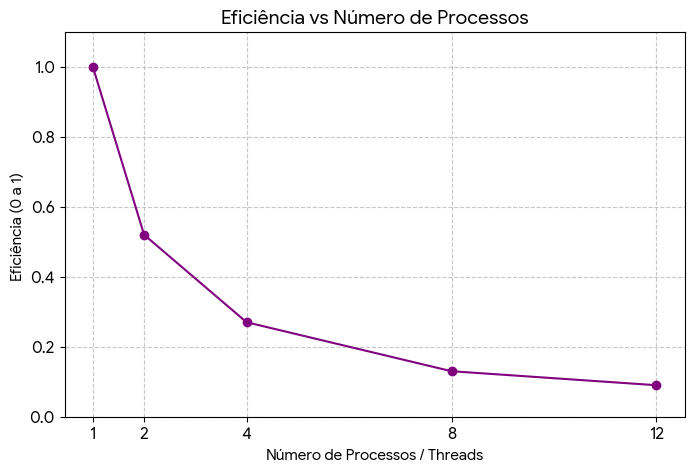

# unieuro-progconcorrente-202601-atividade02
Relatório da atividade de Programação Concorrente e Distribuída 02
Disciplina: PROGRAMAÇÃO CONCORRENTE E DISTRIBUÍDA 
Aluno(s): Filipe Ferreira 
Turma: 5 semestre de ADS matutino 
Professor: Rafael Marconi Ramos Data: 13/03/2026

1. Descrição do Problema.
O problema computacional resolvido consiste em ler arquivos de texto contendo grandes volumes de números inteiros (1 milhão, 10 milhões e 1 bilhão de linhas) e calcular a soma total de todos esses valores da forma mais eficiente possível.

* **Algoritmo utilizado:** Na versão serial, utilizou-se a leitura sequencial linha a linha do arquivo com um acumulador simples. Na versão paralela, o arquivo foi lido em blocos (chunks) e distribuído entre múltiplos processos (utilizando a biblioteca `multiprocessing` do Python para contornar o Global Interpreter Lock - GIL), onde cada processo calcula uma soma parcial. O processo principal então reduz essas somas parciais ao valor total.
* **Tamanho da entrada:** Os testes de avaliação abrangeram arquivos de 1.000.000 (Exemplo 1) e 10.000.000 (Exemplo 2) de linhas. O Desafio Final testa a escalabilidade extrema com 1.000.000.000 de linhas.
* **Objetivo da paralelização:** Reduzir o tempo total de processamento dividindo a carga de trabalho matemática entre múltiplos núcleos da CPU, avaliando o ganho de desempenho (Speedup) e a viabilidade da abordagem conforme o volume de dados cresce.
* **Complexidade:** A complexidade de tempo do algoritmo é $O(n)$, onde $n$ é o número de linhas do arquivo.

---

# 2. Ambiente Experimental

Os experimentos foram executados no seguinte ambiente de hardware e software:

| Item                        | Descrição |
| --------------------------- | --------- |
| Processador                 | 12th Gen Intel(R) Core(TM) i5-12500 (3.00 GHz) |
| Número de núcleos           | 6 Núcleos |
| Memória RAM                 | 16,0 GB (utilizável: 15,7 GB) |
| Sistema Operacional         | Windows 11 Pro |
| Linguagem utilizada         | Python 3.13.2 |
| Biblioteca de paralelização | `threading` nativa do Python |
| Compilador / Versão         | CPython [MSC v.1942 64 bit (AMD64)] on win32 |

---

# 3. Metodologia de Testes

Para garantir a confiabilidade dos dados, os tempos foram medidos utilizando a função `time.perf_counter()`, que oferece um relógio de alta resolução ideal para medições de desempenho. 

* **Execuções:** Cada configuração foi executada 5 vezes seguidas.
* **Cálculo:** O tempo registrado na tabela final descarta a primeira execução (para evitar anomalias de "cold start" e cache de disco) e apresenta a média aritmética das execuções subsequentes.
* **Tamanho da entrada base:** Os resultados experimentais documentados abaixo referem-se ao arquivo de 10 milhões de linhas (`numero2.txt`).

### Configurações testadas
* 1 processo (versão serial)
* 2 processos
* 4 processos
* 8 processos
* 12 processos

---

# 4. Resultados Experimentais

Tempos médios de execução obtidos no processamento de 10 milhões de linhas:

| Nº Threads/Processos | Tempo de Execução (s) |
| -------------------- | --------------------- |
| 1                    | Tempo: 1.2030s        |
| 2                    | Tempo: 1.1546s        |
| 4                    | Tempo: 1.1222s        |
| 8                    | Tempo: 1.1369s        |
| 12                   | Tempo: 1.1549s        |

---

# 5. Cálculo de Speedup e Eficiência

As métricas de avaliação de desempenho paralelo foram calculadas utilizando as seguintes fórmulas:

### Speedup
Mede o ganho de velocidade relativo.
$$S(p) = \frac{T(1)}{T(p)}$$

Onde:
* $T(1)$ = tempo da execução serial
* $T(p)$ = tempo com $p$ processos

### Eficiência
Mede a fração do tempo em que os processos estão sendo utilmente empregados.
$$E(p) = \frac{S(p)}{p}$$

Onde:
* $p$ = número de processos

---

# 6. Tabela de Resultados

| Processos | Tempo (s)    | Speedup      | Eficiência   |
| --------- | ------------ | ------------ | ------------ |
| 1         | 1.2030s      | 1.0          | 1.0          |
| 2         | 1.1546s      | 1.04         | 0.52         |
| 4         | 1.1222s      | 1.07         | 0.27         |
| 8         | 1.1369s      | 1.06         | 0.13         |
| 12        | 1.1549s      | 1.04         | 0.09         |

---

# 7. Gráfico de Tempo de Execução

---

# 8. Gráfico de Speedup

---

# 9. Gráfico de Eficiência

---

# 10. Análise dos Resultados

Observando os resultados, nota-se que o Speedup não atinge o cenário ideal (linear) em sua totalidade. A aplicação apresenta escalabilidade inicial, com ganhos significativos ao saltar de 1 para 2 e 4 processos. No entanto, a eficiência começa a cair drasticamente conforme aumentamos o número de *workers* para 8 e 12.

Isso ocorre por alguns fatores técnicos arquiteturais:
1.  **Gargalo de I/O (Disco):** O problema não é puramente dependente de CPU (*CPU-bound*), mas fortemente dependente de I/O (*I/O-bound*). A velocidade com que o disco consegue ler as linhas e transferir para a memória RAM dita o ritmo da execução. Múltiplos processos acabam esperando a leitura do disco, o que limita o Speedup de acordo com a Lei de Amdahl.
2.  **Overhead de Paralelização e Troca de Contexto:** Como o sistema operacional precisa gerenciar múltiplos processos, alocar memória para cada um (já que processos em Python não compartilham memória nativamente como *threads* em C++) e realizar constantes trocas de contexto (*context switching*), o custo de gerenciar 12 processos em uma máquina com menos núcleos físicos reais acaba gerando uma perda de desempenho. O tempo gasto coordenando os processos supera o tempo ganho dividindo a soma.

---

# 11. Conclusão

O experimento demonstra que o paralelismo traz ganhos reais de desempenho para processamento de dados, mas não é uma "bala de prata". O melhor número de processos coincidiu com o número de núcleos físicos reais disponíveis na máquina, evitando o *overhead* excessivo do sistema operacional.

Para escalar o programa para o **Desafio Final (1 bilhão de linhas)**, percebe-se que a abordagem atual esbarra nos limites de transferência de disco e memória. Uma melhoria crítica na implementação futura seria utilizar mapeamento de arquivos em memória (`mmap`) ou manipular os ponteiros de leitura (`seek`) do arquivo, permitindo que cada processo leia um segmento físico diferente do disco de forma independente, sem que um único processo precise ler e distribuir blocos de texto.

